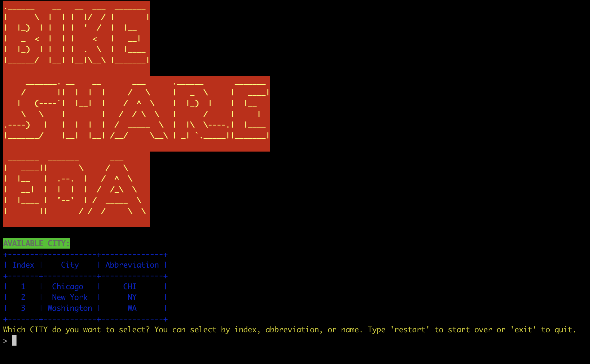

# Bike share analyzer

BikeShareAnalyzer is a Python command-line tool for analyzing bike share data. It provides various statistics and insights based on selected filters, such as popular times of travel, stations, trip durations, and user information. Analyze bike share data for cities like Chicago, New York, and Washington and make informed decisions based on the data.

## Installation

To make the project work smoothly, you need the following libraries installed:

- colorama: For colored terminal text. Install with `pip install colorama`.
- tabulate: For formatted tables. Install with `pip install tabulate`.
- prompt_toolkit: For command-line interfaces. Install with `pip install prompt_toolkit`.
- termcolor: For colored text in the terminal. Install with `pip install termcolor`.
- pyfiglet: For ASCII art. Install with `pip install pyfiglet`.
- pandas: For data manipulation. Install with `pip install pandas`.

You can install all the required libraries by running the following command:

pip install colorama tabulate prompt_toolkit termcolor pyfiglet pandas

Once you have the libraries installed, you can run the script by executing `python bikeshare.py` in your terminal or command prompt. Make sure the bike share data files (`chicago.csv`, `new_york_city.csv`, `washington.csv`) are in the same directory as the script.

## Usage

1. Upon running the program, you will see a splash screen with the title "Bike share EDA".
2. Follow the on-screen prompts to select a city, time filter, and specific day/month if applicable.
3. The program will load and analyze the data based on your selections, displaying various statistics and the raw data.
4. You can choose to view more raw data or exit the program.

## Features

- Select a city (Chicago, New York, Washington) to analyze bike share data.
- Choose a time filter (Day, Month, Both, None) to filter the data by day of the week and/or month.
- View statistics for popular times of travel, stations, trips, trip durations, and user information.
- View raw data in chunks and choose to view more or exit.

## Contributing

Contributions to BikeShareAnalyzer are welcome! If you find any issues or have suggestions for improvements, please feel free to open an issue or submit a pull request.

## License

This project is licensed under the [MIT License](LICENSE).

---
Note: The bike share data files (`data/chicago.csv`, `data/new_york_city.csv`, `data/washington.csv`) are not included in this repository. Make sure to have the appropriate data files available in the same directory as the program to run the analysis.

Enjoy analyzing the bike share data!
